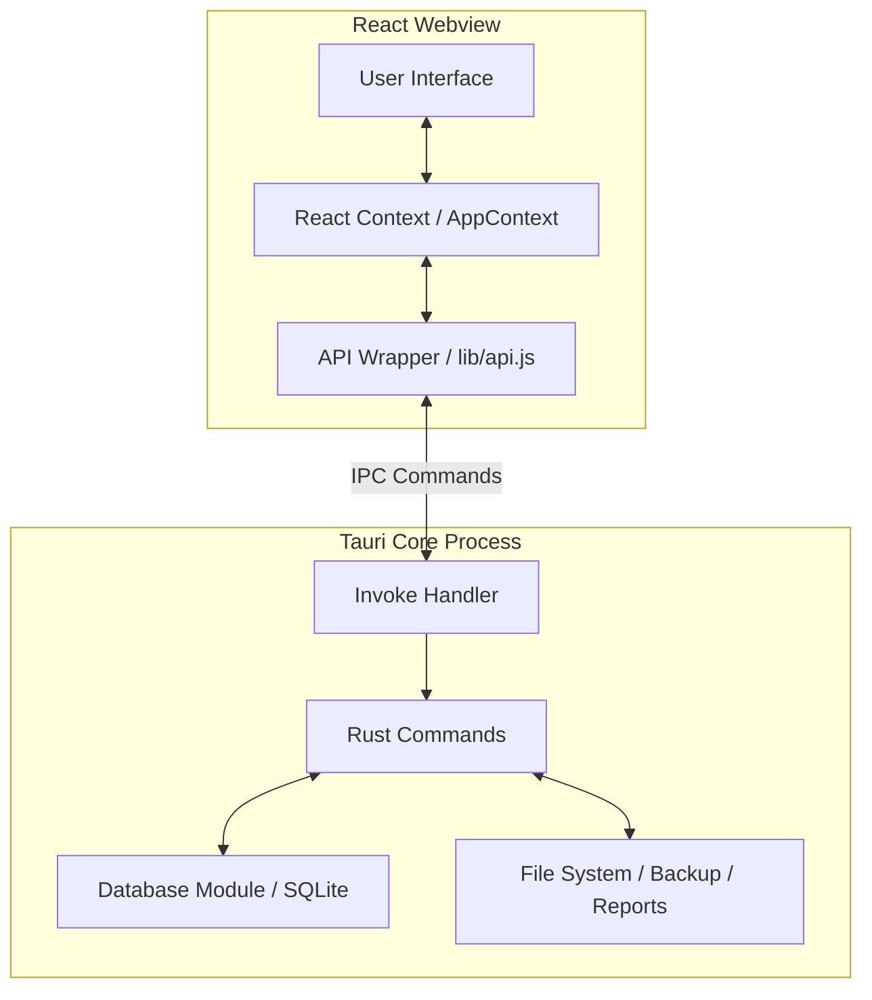

# Architecture Documentation

## System Overview
ExpenShare is built on the **Tauri v2** framework, which uses a multi-process architecture. It consists of a Rust-based Core Process (Backend) that handles system-level operations and a Webview Process (Frontend) that renders the user interface.

## Tech Stack
- **Frontend:** React 19, Tailwind CSS v4, Vite.
- **Backend:** Rust, Tauri v2 API.
- **Database:** SQLite (via `rusqlite` with the `bundled` feature).
- **PDF Generation:** `printpdf` (Pure Rust, no external dependencies).

## High-Level Architecture

## Component Details

### Frontend (React / Vite)
- **State Management:** Handled centrally via `AppContextCore.jsx` and `AppContext.jsx`. It manages the global state (settings, theme, loading progress, people) and provides a `refreshSettings` trigger.
- **API Layer:** `src/lib/api.js` serves as a wrapper around Tauri's `invoke` IPC mechanism, strongly typing the command names and payloads.
- **Routing:** Handled via React Router or conditional rendering in `App.jsx` (`Shell` component).
- **Styling:** Tailwind CSS v4 with custom CSS variables in `theme.css` for instant Light/Dark mode switching without FOUT (Flash of Unstyled Theme).

### Backend (Rust / Tauri)
- **Command Modules:** Business logic is divided into logical modules inside `src-tauri/src/commands/`:
  - `income.rs`, `expenses.rs`, `dashboard.rs`, `extra_budget.rs`, `goals.rs`, `settings.rs`, `reports.rs`, `backup.rs`.
- **Database State:** The SQLite connection is wrapped in a `Mutex` and managed by Tauri's state management (`app.manage(DbState(Mutex::new(conn)))`).
- **Plugins:** 
  - `tauri-plugin-dialog`, `tauri-plugin-fs`, `tauri-plugin-log`.
  - Desktop-only plugins: `tauri-plugin-window-state`, `tauri-plugin-single-instance`, `tauri-plugin-updater`, `tauri-plugin-process`.

## Data Flow Example: Adding an Expense
1. User submits the expense form in the UI.
2. React calls `tauriAPI.expenses.create(payload)`.
3. The API wrapper sends an IPC message to the Rust backend invoking `expenses_create`.
4. The Rust command acquires the SQLite Mutex lock from the managed state.
5. An `INSERT` query is executed.
6. A success response is returned to the frontend.
7. The frontend triggers a data refresh (`notifyDataChanged`), re-fetching the updated monthly data.

## Cross-Platform Considerations
- **Desktop (Windows/macOS/Linux):** Includes window management, single-instance locking, and auto-updating via MSI/AppImage.
- **Mobile (Android/iOS):** Desktop-specific plugins (`updater`, `process`, `window-state`) are explicitly gated out using `cfg` attributes in `Cargo.toml` and capabilities JSON files to ensure clean compilation on mobile.
